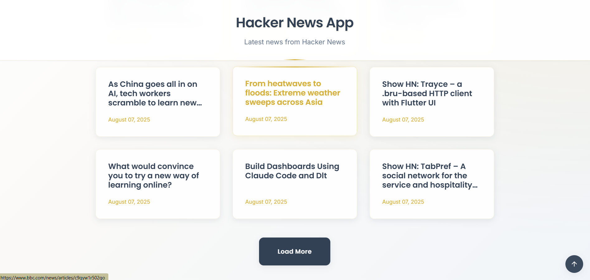

# 📰 Hacker News NewsApp
**Aggregatore di notizie Hacker News –## Setup e inst## Tech stack**
- **JavaScript ES6+** per la logica applicativa con moduli e async/await
- **Webpack 5** per bundling, dev server e gestione asset
- **Axios** come HTTP client per chiamate API ottimizzate
- **dotenv-webpack** per gestione sicura delle environment variables
- **Lodash** (`get`) per accesso sicuro alle proprietà degli oggetti
- **CSS modulare** con metodologia BEM e variabili CSS custom
- **HTML semantico** per accessibilità e SEO

Le tecnologie sono state scelte per garantire modularità, sicurezza nell'accesso ai dati, gestione professionale delle configurazioni e facilità di manutenzione.e
1. Clonare la repository
2. Installare le dipendenze con `npm install`
3. **Configurare le environment variables:**
   - Copiare `.env.example` in `.env`
   - Personalizzare le variabili se necessario (l'URL API è già configurato)
4. Avviare l'ambiente di sviluppo con `npm run start`
5. Per la build di produzione, eseguire `npm run build`
6. Aprire `dist/index.html` per visualizzare la versione buildatatto JavaScript Advanced

---

## 📋 Descrizione
Applicazione web per consultare le ultime notizie da **Hacker News**, con caricamento progressivo e interfaccia accessibile. Destinata a chi desidera un'esperienza di lettura ordinata, responsiva e moderna.

---

## ✨ Features principali
- **Visualizzazione notizie** con paginazione ("Load More")
- **Loader animato** accessibile durante il caricamento
- **Scroll-to-top button** ↑ per navigazione rapida
- **Gestione fine notizie** e messaggi di stato
- **Accesso sicuro** alle proprietà degli oggetti tramite Lodash
- **Layout responsive** adattivo su mobile e desktop
- **HTTP client Axios** per chiamate API ottimizzate
- **Environment Variables** per configurazione sicura

## Descrizione
Applicazione web che consente di consultare le ultime notizie da Hacker News, con caricamento progressivo e interfaccia accessibile. Destinata a chi desidera un’esperienza di lettura ordinata, responsiva e moderna.

## Features principali
- Visualizzazione delle notizie Hacker News con paginazione (“Carica altre notizie”)
- Loader animato accessibile durante il caricamento
- Pulsante flottante “Torna su” per navigazione rapida
- Gestione fine notizie e messaggi di stato
- Accesso sicuro alle proprietà degli oggetti tramite Lodash
- Layout responsive e adattivo su mobile e desktop

## 🗂️ Struttura del progetto

```
    📁 javascript-advanced/
    └── 📁src
        └── 📁css
            └── 📁components
                ├── 📄 button.css
                ├── 📄 card.css
                ├── 📄 loader.css
            └── 📁layout
                ├── 📄 footer.css
                ├── 📄 header.css
                ├── 📄 main.css
            ├── 📄 _utilities.css
            ├── 📄 _variables.css
            ├── 📄 style.css
        └── 📁img
            ├── 📄 favicon.png
        └── 📁js
            ├── 📄 api.js
            ├── 📄 app.js
            ├── 📄 helpers.js
        ├── 📄 index.html
    ├── 📄 .env (environment variables)
    ├── 📄 .env.example (template per le env vars)
    ├── 📄 .gitignore
    ├── 📄 eslint.config.mjs
    ├── 📄 package-lock.json
    ├── 📄 package.json
    ├── 📄 README.md
    └── 📄 webpack.config.js
```
## Setup e installazione
1. Clonare la repository
2. Installare le dipendenze con `npm install`
3. Avviare l’ambiente di sviluppo con `npm run start`
4. Per la build di produzione, eseguire `npm run build`
5. Aprire `dist/index.html` per visualizzare la versione buildata

## Tech stack
- JavaScript ES6+ per la logica applicativa
- Webpack per bundling e gestione asset
- Lodash (`get`) per accesso sicuro alle proprietà degli oggetti
- CSS modulare con BEM e variabili custom
- HTML semantico per accessibilità

Le tecnologie sono state scelte per garantire modularità, sicurezza nell’accesso ai dati e facilità di manutenzione.

## 🎨 Scelte di design e accessibilità

- **Palette navy/gold soft**, design minimal e ordinato
- **Layout responsive** mobile-first con media queries
- **Focus visibile** per la navigazione da tastiera
- **Attributi ARIA** e ruoli semantici per screen reader
- **Componenti UI coerenti**, nessuno stile inline

## Gestione errori e loading
- **Axios interceptors** per gestione centralizzata degli errori HTTP
- **Timeout configurabile** (10 secondi) per prevenire richieste bloccate
- **Loader animato** accessibile durante le chiamate API
- **Messaggi di errore** user-friendly in caso di problemi di rete, timeout o API non raggiungibile
- **Stato UI sempre coerente**, nessun dato parziale visualizzato
- **Fine notizie** gestita con messaggio dedicato e disabilitazione del pulsante
- **Environment variables** per configurazione sicura dell'endpoint API

## Screenshots

<div align="center">

### 🖥️ Desktop View


*Vista desktop: layout responsive a griglia con card organizzate e design navy/gold*

### 📱 Mobile View  


*Vista mobile: layout verticale ottimizzato con pulsante scroll-to-top e design adattivo*

</div>

## Deploy
La demo online è disponibile al seguente link:  
**[🚀 Hacker News App - Live Demo](https://javascript-advanced-hacker-news-app.netlify.app)**

La pubblicazione è avvenuta tramite Netlify con deploy automatico da GitHub.

## ⚙️ Environment Variables
Il progetto utilizza **dotenv-webpack** per la gestione sicura delle configurazioni:

### Variabili disponibili:
- `HACKER_NEWS_API_URL`: URL base dell'API Hacker News
- `NODE_ENV`: Ambiente di esecuzione (development/production)
- `APP_NAME`: Nome dell'applicazione

### Configurazione:
1. Copiare `.env.example` in `.env`
2. Personalizzare le variabili se necessario
3. Il file `.env` è escluso dal version control per sicurezza

```bash
# File .env.example
HACKER_NEWS_API_URL=https://hacker-news.firebaseio.com/v0
NODE_ENV=development
APP_NAME=Hacker News App
```

## Credits e riferimenti
- API Hacker News: https://github.com/HackerNews/API
- Documentazione Lodash: https://lodash.com/docs
- Progetto realizzato per Start2Impact – JavaScript Advanced

## Idee extra e sviluppi futuri
- Implementazione di ricerca e filtri sulle notizie
- Salvataggio delle notizie preferite in locale
- Modalità dark/light
- Miglioramento SEO